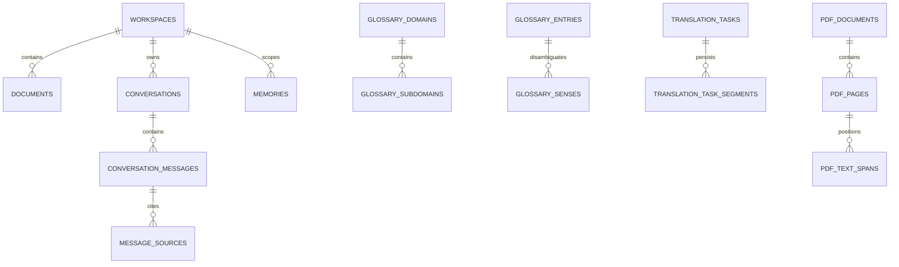

# SQLite 数据模型

```mermaid
erDiagram
  WORKSPACES ||--o{ DOCUMENTS : contains
  WORKSPACES ||--o{ CONVERSATIONS : owns
  WORKSPACES ||--o{ MEMORIES : scopes
  GLOSSARY_DOMAINS ||--o{ GLOSSARY_SUBDOMAINS : contains
  GLOSSARY_ENTRIES ||--o{ GLOSSARY_SENSES : disambiguates
  TRANSLATION_TASKS ||--o{ TRANSLATION_TASK_SEGMENTS : persists
  CONVERSATIONS ||--o{ CONVERSATION_MESSAGES : contains
  CONVERSATION_MESSAGES ||--o{ MESSAGE_SOURCES : cites
  PDF_DOCUMENTS ||--o{ PDF_PAGES : contains
  PDF_PAGES ||--o{ PDF_TEXT_SPANS : positions
```

Migration 0001 建立基础业务表、FTS5、索引与外键；0002 增加完整产品表、任务缓存、PDF/OCR、预设和配置字段；0003 写入七大领域及六组站点规则。每次连接启用 foreign keys 与 WAL。升级只通过 migration，不重建用户库。
